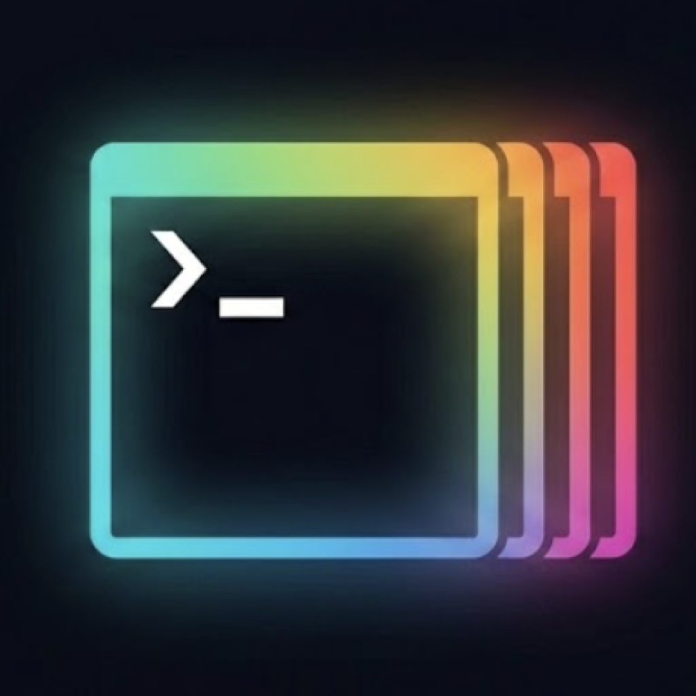
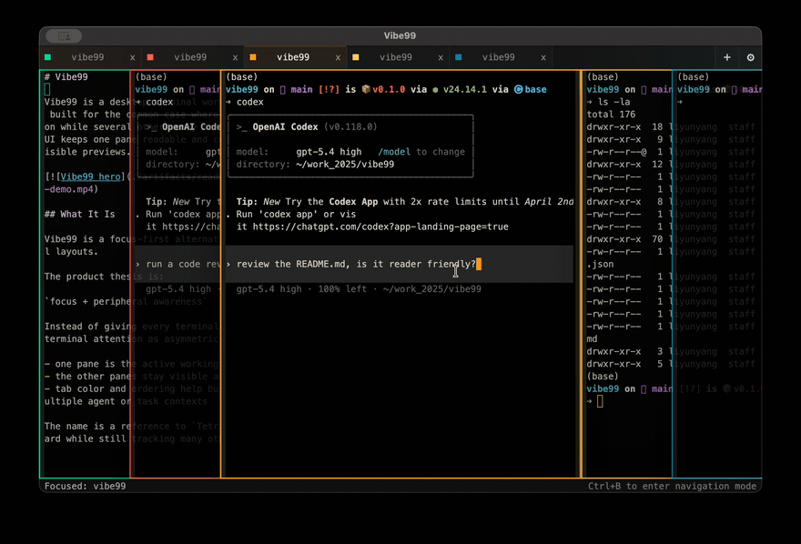

<p align="center">
  
</p>

<h1 align="center">Vibe99</h1>

<p align="center">
  Desktop terminal workspace for agentic coding.
</p>

Vibe99 is a desktop terminal workspace for agentic coding. It is built for the common case where one terminal needs full attention while several others only need peripheral visibility, so the UI keeps one pane readable and stacks the rest so you can still see what the agents are doing.



## Quick Start

Linux and Windows users can install from the [GitHub Releases page](https://github.com/NekoApocalypse/Vibe99/releases).

- Linux artifacts: `.AppImage`, `.deb`, and `.zip`
- Windows artifacts: portable `.exe` and `.zip`

If you are on Windows and the portable `.exe` has trouble starting, reports missing DLL files, or launches very slowly, use the Windows `.zip` artifact instead.

macOS users, or anyone who wants to run from source, should clone this repository and start the app locally:

```bash
git clone https://github.com/NekoApocalypse/Vibe99.git
cd Vibe99
npm install
npm start
```

## Basic Controls

- `Cmd+T` on macOS or `Ctrl+T` elsewhere: add a pane
- `Ctrl+B`: enter navigation mode
- `Left` / `Right` or `H` / `L` in navigation mode: move focus
- `Enter` in navigation mode: focus the selected terminal
- double-click a tab: rename it
- drag a tab: reorder panes
- top-right `+`: add pane
- top-right gear: open display settings

## Stack

- Electron
- `xterm.js`
- `@xterm/addon-fit`
- `@homebridge/node-pty-prebuilt-multiarch`

## Contributing
See [CONTRIBUTING.md](/Users/liyunyang/work_2025/vibe99/CONTRIBUTING.md).
